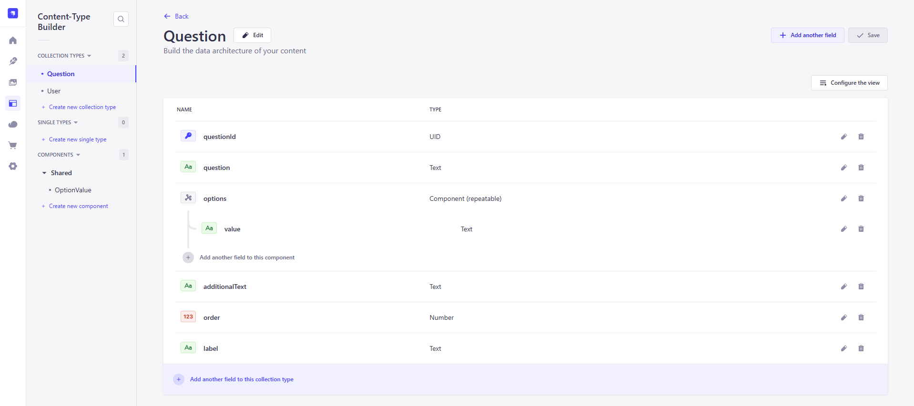
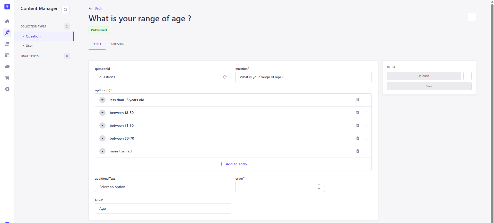

# Question workflow app

This is a project built with [Strapi](https://docs.strapi.io/). It allows admin users who have access to the Strapi Admin panel can define a collection of questions and possible answers. 

This project works in conjunction with [question-workflow-app-frontend](https://github.com/lrasata/question-workflow-frontend-app) which presents the workflow questions to the end-user who is able to select its answers.


### Backend built with Strapi

Strapi is a headless CMS. In this case, it is used to define the schema of a question :



And it allows admin users of teh Strapi admin panel to quickly provide data entries



Data entries are then available for read on the following endpoint : `/api/questions`

### Instruction and Set up

Strapi comes with a full featured [Command Line Interface](https://docs.strapi.io/dev-docs/cli) (CLI) which lets you scaffold and manage your project in seconds.

### `develop`

Start your Strapi application with autoReload enabled. [Learn more](https://docs.strapi.io/dev-docs/cli#strapi-develop)

```
npm run develop
# or
yarn develop
```

### `start`

Start your Strapi application with autoReload disabled. [Learn more](https://docs.strapi.io/dev-docs/cli#strapi-start)

```
npm run start
# or
yarn start
```

### `build`

Build your admin panel. [Learn more](https://docs.strapi.io/dev-docs/cli#strapi-build)

```
npm run build
# or
yarn build
```

### `deploy`

This project is configured with `AWS S3 provider` as all assets of the Media library are stored in a `S3 bucket` on deployment.

For testing purposes, this project was successfully deployed on AWS following the [step by step guide](https://strapi.io/integrations/aws) which provides instructions on how to integrate AWS with Strapi.
The Strapi project was deployed on `AWS EC2 instance` inside a `AWS VPC`. The ec2 instance was connected to `AWS RDS Postgresql database`  and used `AWS S3` to host and serve images.


## 📚 Learn more

- [Resource center](https://strapi.io/resource-center) - Strapi resource center.
- [Strapi documentation](https://docs.strapi.io) - Official Strapi documentation.
- [Strapi tutorials](https://strapi.io/tutorials) - List of tutorials made by the core team and the community.
- [Strapi blog](https://strapi.io/blog) - Official Strapi blog containing articles made by the Strapi team and the community.
- [Changelog](https://strapi.io/changelog) - Find out about the Strapi product updates, new features and general improvements.

Feel free to check out the [Strapi GitHub repository](https://github.com/strapi/strapi). Your feedback and contributions are welcome!

## ✨ Community

- [Discord](https://discord.strapi.io) - Come chat with the Strapi community including the core team.
- [Forum](https://forum.strapi.io/) - Place to discuss, ask questions and find answers, show your Strapi project and get feedback or just talk with other Community members.
- [Awesome Strapi](https://github.com/strapi/awesome-strapi) - A curated list of awesome things related to Strapi.


